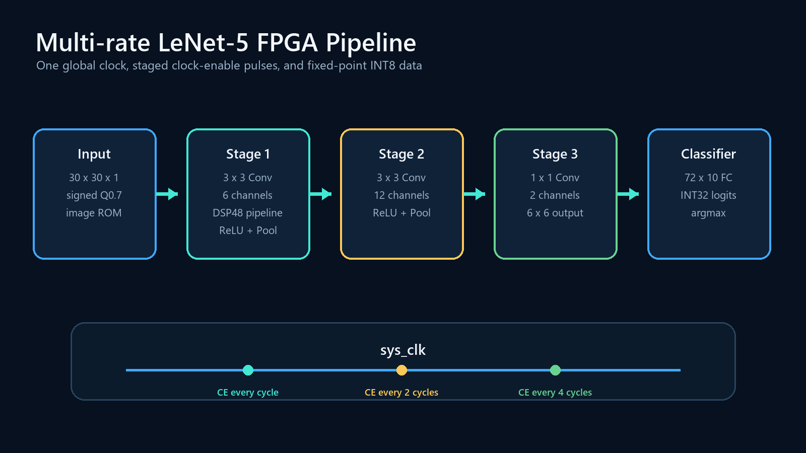
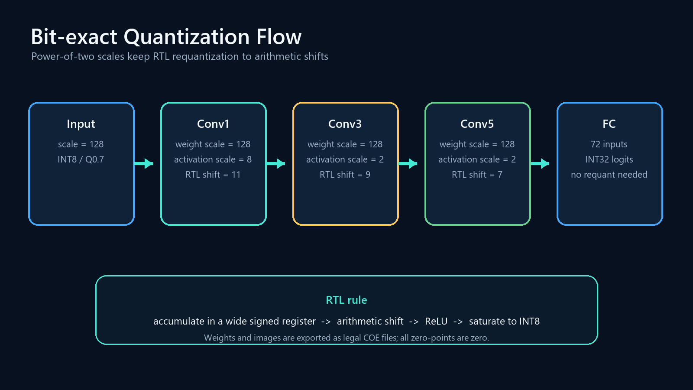
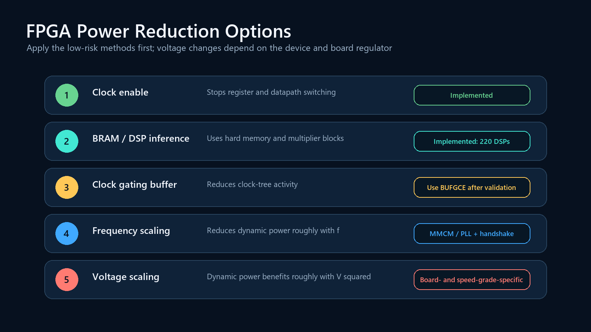

# Multi-rate LeNet-5 CNN Accelerator

這是一個以 Verilog 實作的 LeNet-5 FPGA 推論加速器。輸入為 30×30 MNIST 影像，資料路徑使用 signed INT8，卷積累加使用較寬的 signed accumulator。

原始設計在兩次 max pooling 後分別產生 `f/2`、`f/4` fabric clock。修正版保留三個 stage 的不同運作速率，但改成**單一 global clock + clock-enable pulse**，第二級每兩拍更新、第三級每四拍更新。這消除了 layer 間 CDC，也避免把一般暫存器輸出當成 clock。



## Network and quantization

| Stage | Shape | Operation | Activation scale | RTL shift |
|---|---:|---|---:|---:|
| Input | 30×30×1 | signed INT8 | 128 | — |
| Stage 1 | 28×28×6 → 14×14×6 | 3×3 Conv + ReLU + MaxPool | 8 | 11 |
| Stage 2 | 12×12×12 → 6×6×12 | 3×3 Conv + ReLU + MaxPool | 2 | 9 |
| Stage 3 | 6×6×2 | 1×1 Conv + ReLU | 2 | 7 |
| Classifier | 10 logits | 72×10 FC | INT32 logits | — |

Weights use signed Q0.7 (`scale=128`, `zero_point=0`). Power-of-two activation scales let the RTL perform requantization with rounding, arithmetic shifts and saturation. Bias is disabled in this revision because the old 8-bit bias entry was added directly to a wider product accumulator at the wrong scale.



The checked-in checkpoint and COE files were trained for ten epochs with seed 7. Verification over all 10,000 MNIST test images reports:

- exported integer COE model vs. PyTorch prediction: **100.00% match**
- integer model test accuracy: **93.86%**

The exact configuration is recorded in [`weights/quantization.json`](weights/quantization.json).

## Reproduce the weights

Create a Python environment and install the pinned dependencies:

```powershell
python -m venv .venv
.\.venv\Scripts\python.exe -m pip install -r requirements.txt
```

Train and export weights, then export ten test images:

```powershell
.\.venv\Scripts\python.exe .\LeNet_Main.py --epochs 10
.\.venv\Scripts\python.exe .\images_out.py --count 10
.\.venv\Scripts\python.exe .\tools\verify_quantized_model.py --count 10000
```

Generated ROM files are stored under `weights/`. Each Block Memory Generator XCI is kept in its own `ip/<module>/` directory and uses a repository-relative COE path instead of a path to the original author's Desktop.

The image ROM contains ten exported samples. The current top-level hardware deterministically starts at address 0 and evaluates the first 900-byte image. Reset no longer reads its own reset state to choose another image; add an explicit image-index input when a board demo needs run-time sample selection.

## Vivado verification

The included PowerShell runner targets the installed Vivado 2025.1 toolchain:

```powershell
.\scripts\run_vivado.ps1 -Task syntax
.\scripts\run_vivado.ps1 -Task unit
.\scripts\run_vivado.ps1 -Task constraints
.\scripts\run_vivado.ps1 -Task regen-ip  # only after changing ROM geometry or Vivado IP version
.\scripts\run_vivado.ps1 -Task ip
.\scripts\run_vivado.ps1 -Task rtl-ip
.\scripts\run_vivado.ps1 -Task top-sim
.\scripts\run_vivado.ps1 -Task synth
.\scripts\run_vivado.ps1 -Task timing  # re-report an existing synthesis checkpoint
```

Use `-Part` and `-ClockPeriodNs` for a different FPGA or target frequency.

The self-checking unit test covers signed widening, worst-case convolution accumulation, ReLU rounding/saturation, all 72 FC inputs, and `/2`/`/4` enable cadence. The `top-sim` task uses all five real Block Memory Generator simulation models, checks representative first/last ROM values, rejects unknown logits and runs the first stored MNIST image through all three stages. It also requires the exact ten-logit result `[-1021, -2175, 186, 251, -1017, -862, -2614, 787, -749, 371]`. At a 100 MHz simulation clock the pipelined design completes at 15.346 µs and predicts the expected class 7.

This top-level check is a functional smoke test for the repaired control path, not a claim of cycle-by-cycle equivalence for the full test set. A stricter diagnostic comparison with the tensor reference first diverges at pooled stage-1 sample 30 (one channel is 0 in the streaming RTL and 1 in the tensor model). The dependency-free `tools/reference_first_image.py` records the exact tensor-side intermediate summaries and logits for a future controller rewrite. Therefore, use the 93.86% result as the exported integer **software model** accuracy; hardware-wide accuracy still needs a multi-image input selector and an RTL regression over the dataset.

The `ip` task validates the repository-relative COE paths and generates the five Block Memory Generator products. The `rtl-ip` task elaborates the complete top hierarchy with those real ROM IPs. The full synthesis flow first synthesizes the arithmetic hierarchy with ROM interface stubs and then links the five generated ROM checkpoints before `opt_design` and reporting.

The first layer forces its 54 8×8 multipliers into DSP48E1 blocks and enables the DSP output register. The balanced adder tree remains in LUT/carry logic. Its one-cycle latency is matched by the layer-1 pooling valid and interface controls, and the layer-3 `/4` enable phase is shifted by two master cycles. The bit-exact top-level test confirms that this scheduling change does not alter any final logit.

Layers 2 and 3 advance only on `/2` and `/4` clock-enable pulses. Their arithmetic destination registers therefore receive paired setup/hold multicycle constraints of 2/1 and 4/3 cycles. `load_weight` is stable across the entire ROM-load interval and its source is also constrained as a 2/1-cycle control path. The synthesis script re-resolves and checks these collections after `opt_design`, because that pass may rebuild register objects.

On `XC7Z020CLG400-1` with a 10 ns master clock, Vivado 2025.1 reports:

| Check | XC7Z020 result |
|---|---:|
| Slice LUTs | 50,799 / 53,200 (95.49%) |
| Slice registers | 23,981 / 106,400 (22.54%) |
| BRAM tiles | 4.5 / 140 (3.21%) |
| DSP48E1 | 220 / 220 (100.00%) |
| DSP distribution | layer 1: 54; layer 2: 122; layer 3: 44 |
| Setup WNS / TNS at 100 MHz | +2.262 ns / 0 ns |
| Hold WHS / THS | +0.070 ns / 0 ns |
| Bonded I/O | 330 / 125 (264.00%) |

These are optimized synthesis estimates with the real ROM netlists and correct clock-enable multicycle constraints; placement and routing have not been run. LUT, DSP, setup and hold checks are enforced by `scripts/synth.tcl`. The current verification-oriented `top` exports ten 32-bit logits and status signals, so its 330 logical I/O exceed the 125 bonded I/O of the package and have no board pin assignments. A board wrapper must expose the accelerator through AXI, BRAM, UART or a small register interface before placement, routing and bitstream generation. No valid PYNQ-Z2 bitstream is claimed by this result.

## Power strategy



The current clock-enable implementation reduces unnecessary register and datapath switching while keeping one clock domain. After the model and board target are fixed, a BUFGCE-based stage gate can additionally stop clock-tree switching. MMCM/PLL frequency changes are useful only when the workload or latency target changes at runtime; they require lock/reconfiguration control and a clean transfer protocol.

Changing FPGA core voltage is board- and device-specific. Do not lower `VCCINT` below the selected part's documented operating range. Boards with a programmable PMBus regulator can sometimes select supported voltage modes or enable research DVFS, but frequency, voltage, timing closure and rail measurement must be controlled together.

## Repository layout

- `layer_1.v`, `layer_2.v`, `layer_3.v`: three compute stages
- `conv33.v`, `conv11.v`, `OutputAccumulator.v`, `fully_connected.v`: arithmetic kernels
- `LeNet_Main.py`: fixed-point-aware training and COE export
- `images_out.py`: deterministic 30×30 image export
- `verification/`: self-checking RTL testbench and ROM black boxes
- `ip/`: Vivado 2025.1 Block Memory Generator configurations
- `scripts/`: reproducible Vivado commands
- `constraints/`: baseline clock constraint
- `tools/`: integer model verification and diagram generation
- `weights/`: checkpoint, legal COE files, labels and quantization manifest

Environment: Vivado 2025.1, PyTorch 2.14 CPU. Default synthesis part: `XC7Z020CLG400-1`.
